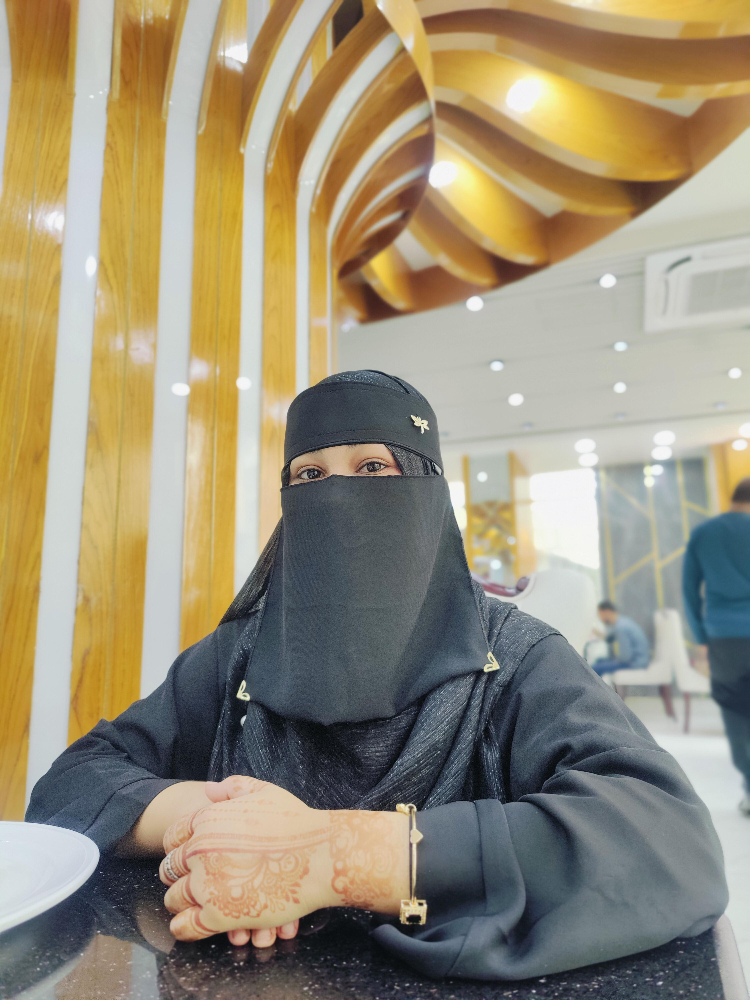

<!DOCTYPE html>
<html>
<head>
<meta name="viewport" content="width=device-width, initial-scale=1.0">
<title>Happy Birthday My Love ❤️</title>

</head>
<body>

<!-- PAGE 1 -->

<h1>🎉 Happy Birthday My Love</h1>

You are the most special person in my life 💕

<button onclick="openModal()">Click for Surprise 💌</button>

🎈

❤️

🎈

<!-- WISH MODAL -->

<h3 style="color:#ff4d6d;text-shadow:1px 1px 5px #ddd;">To My Love ❤️</h3>

 
<button onclick="goPage2()">Next</button>

<!-- PAGE 2 -->

<h2>DO YOU LOVE ME ❤️</h2>
<button onclick="goLovePage()">Yes</button>
<button id="noBtn" onmouseover="moveNo()">No</button>

<!-- PAGE 3 LOVE PAGE -->

🎈

❤️

😘

<button onclick="goMystery()">Next</button>

<!-- PAGE 4 MYSTERY -->

<h2>Select Your Surprise 💖</h2>
<button onclick="goGallery()">Gift 🎁</button>

<!-- PAGE 5 GALLERY -->

<h2>Our Beautiful Memories ❤️</h2>

 

❤️

😘

<button onclick="showFinalGift()">Open Gift 🎁</button>

</body>
</html>
